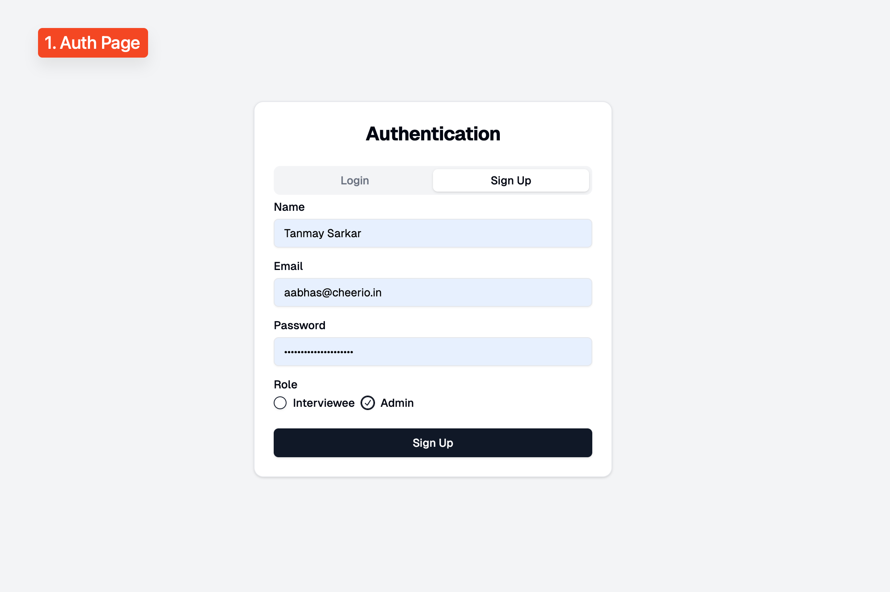
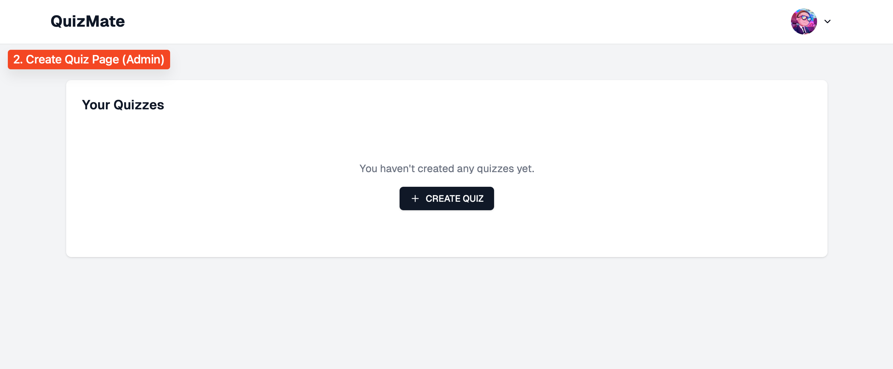
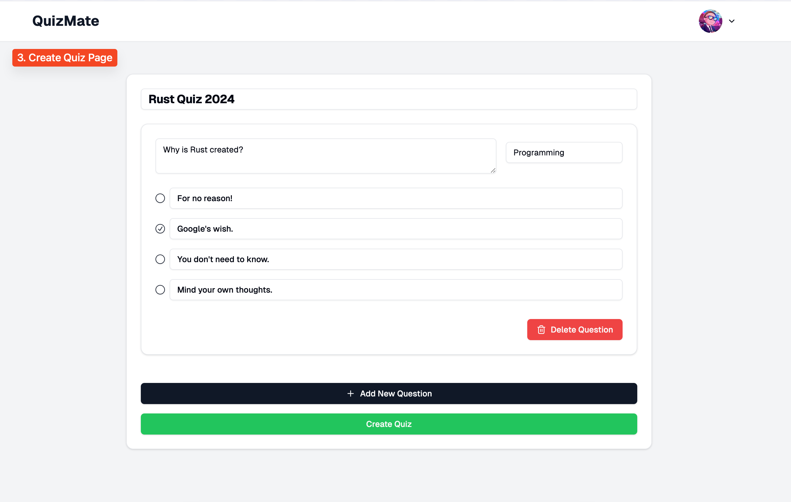

# QuizMate - Quiz Creation and Management System

QuizMate is an easy-to-use platform designed for creating and managing quizzes. Built using Next.js with support for a custom backend API, QuizMate enables admin users to create quizzes, while interviewees can participate and answer questions in real-time.

## Features

- **Create Quizzes**: Admins can create quizzes with multiple questions and customizable answer options.
- **Real-Time Validation**: Ensure that all quiz fields are correctly filled before submission.
- **Save Progress**: Automatically saves progress as you create quizzes (locally using local storage).
- **Responsive Design**: Built with modern UI components, making it responsive and user-friendly on all devices.
- **User Roles**: Support for Admin and Interviewee roles.

## Screenshots

<div style="gap: 8px; display: flex; justify-content: center; align-items: center; flex-wrap: wrap;">
    
    
    
</div>

## Tech Stack

- **Frontend**: Next.js, TypeScript
- **UI Components**: Shadcn UI
- **Backend**: Node.js, Prisma ORM
- **Database**: PostgreSQL
- **Authentication**: JWT-based Auth
- **Deployment**: AWS Lightsail
- **SSL**: Let's Encrypt for HTTPS

## Installation

1. Clone the repository:

    ```bash
    git clone https://github.com/sarkartanmay393/quizmate.git
    cd quizmate
    ```

2. Install dependencies:

    ```bash
    cd backend && npm install && cd ..
    cd frontend && npm install
    ```

3. Set up your environment variables in a `.env` file:

    Backend:
    ```env
    DATABASE_URL=your_database_url
    JWT_SECRET=your_jwt_secret
    ```

    Frontend:
    ```env
    NEXT_PUBLIC_API_URL=your_api_url
    ```

4. Run the development server:

    Backend:
    ```bash
    cd backend && npm run dev
    ```

    Frontend:
    ```bash
    cd frontend && npm run dev
    ```

5. Access the app at `http://localhost:3000`.

## Deployment

QuizMate can be deployed on AWS Lightsail. Make sure to configure your environment variables on the server and set up the proper `.env` file.

For HTTPS, ensure that you have configured SSL certificates using Let's Encrypt:

```bash
sudo certbot --nginx -d yourdomain.com
```

## License

This project is licensed under the MIT License.